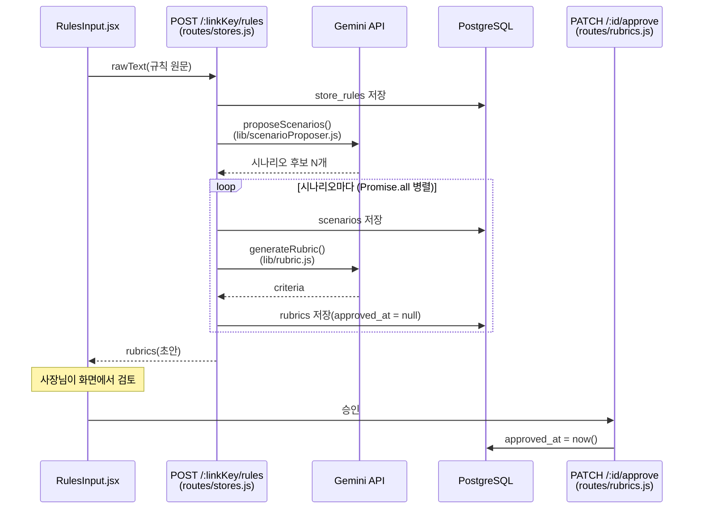
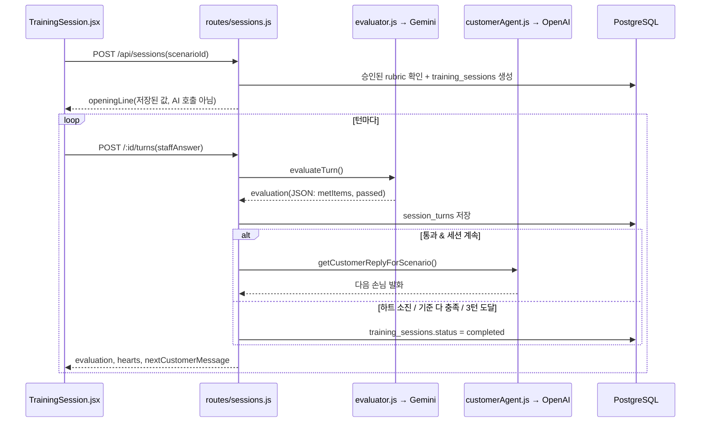

# 매장 맞춤 알바 훈련 서비스

사장님이 매장 응대 기준을 한 번 입력해두면, 새 알바가 올 때마다 AI 손님과 실전처럼 대화 연습을 하고 그 기준에 맞춰 교정 피드백을 받는 웹 서비스.

소상공인 매장은 알바 교체가 잦고 메뉴·규칙도 수시로 바뀌는데, 사장님은 새 알바마다 응대 기준을 반복 설명할 시간과 여력이 없다. 이 서비스는 그 반복 설명을 "AI 손님과의 실전 연습 + 매장 기준에 맞춘 교정"으로 대체한다.

## 핵심 기능

- **AI 손님과의 상황극 대화** — 시나리오 기반, 사장님이 입력한 매장 규칙 반영
- **AI 피드백 및 평가** — 답변이 매장 규칙(루브릭)을 충족했는지 항목별로 판단하고 개선 문장 제안

## 아키텍처

화면(FE) → 서버(Express 라우트) → AI(OpenAI/Gemini) → DB(PostgreSQL)로 이어지는 핵심 흐름 두 가지.

**흐름 A — 규칙 제출 → AI 시나리오/루브릭 생성 → 사장님 승인**

**흐름 B — 알바 훈련 세션 (최대 3턴)**

두 흐름에서 공통으로 지키는 원칙(CLAUDE.md): 손님 에이전트(OpenAI)와 평가 에이전트(Gemini)는 서로 다른 파일에서 절대 한 호출로 합치지 않는다, 사장님이 입력한 규칙은 루브릭(닫힌 채점표)으로 먼저 변환한 뒤 그 기준으로만 채점한다, AI가 만든 루브릭은 사장님이 승인(`approved_at`)하기 전까지 훈련에 쓰이지 않는다.

## 문서

프로젝트 기획·설계 문서는 저장소 위키에서 확인할 수 있다.

- [기획서 (plan)](../../wiki/plan) — 문제 정의, 리프레임 근거, 통계·경쟁 분석, 구현 아키텍처, 화면 구성, 로드맵
- [작업 체크리스트 (checklist)](../../wiki/checklist) — 4주 개발 작업을 레이어·중요도·완성도 축으로 쪼갠 단위 체크리스트
- [개발 Task 백로그 (Notion)](https://app.notion.com/p/AI-Agent-Challenge-Task-3992386a029a80e7bb27c9122d99a904?source=copy_link) — Task 우선순위·상태와 다음 주 목표 관리 (최초 정리본은 [docs/backlog.md](docs/backlog.md))
- [2주차 작업 트래킹 (GitHub Issues)](https://github.com/connect-AIAgentChallenge-26-1/hub/issues/787) — 2주차 세부 작업 10개를 이슈로 쪼개 진행 상황 체크
- [3주차 작업 트래킹 (GitHub Issues)](https://github.com/soyun11/hub/issues/11) — 3주차 세부 작업 10개를 이슈로 쪼개 진행 상황 체크 (2주차와 달리 개인 리포에 등록)

화면 흐름도와 목업 이미지는 작업 PR에서 확인할 수 있다.

## 기술 스택

- 프론트엔드: React
- 백엔드: Express
- DB: PostgreSQL
- AI 로직: OpenAI(손님 에이전트, gpt-4o-mini) + Gemini(평가·루브릭 생성 에이전트) — 역할별로 모델을 분리해서 호출