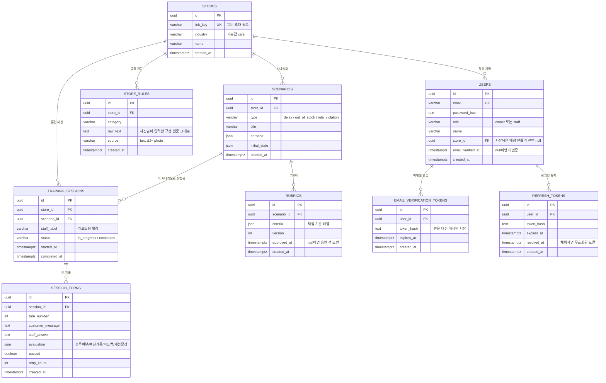

# db-erd.md — albafit DB 구조 (필드까지 포함)

> [db-schema.md](./db-schema.md)의 SQL을 그림으로 옮긴 것. `server/prisma/schema.prisma`, Supabase에 적용된 실제 스키마와 동일해야 하며, 스키마가 바뀌면 이 파일도 같이 갱신한다.

## 전체 관계

## 표마다 뭘 위한 건지

- **`stores`** — 매장 하나. `link_key`는 이제 로그인 대신 "알바 초대 링크"로만 쓰인다.
- **`users`** — 사장님/알바 계정. `role`로 구분. 사장님은 회원가입 직후엔 `store_id`가 비어있다가 매장을 만들면 채워지고, 알바는 사장님이 대시보드에서 계정을 만들어줄 때 바로 채워진다.
- **`store_rules`** — 사장님이 입력한 규정 원문. 나중에 루브릭을 다시 만들 때 원문이 필요해서 변환 후에도 지우지 않는다.
- **`scenarios`** — 카페 시나리오 3종(지연/품절/규칙위반). 매장마다 각각 하나씩 생긴다.
- **`rubrics`** — 시나리오별 채점 기준. `approved_at`이 비어있으면 AI가 막 만든 초안, 채워지면 승인된 것. 사장님이 내용을 수정하면 다시 `null`로 돌아간다(수정된 내용이 승인 안 된 채로 쓰이면 안 되니까).
- **`training_sessions`** — 알바 1명이 시나리오 1개에 도전한 한 판.
- **`session_turns`** — 그 한 판 안에서 "손님 발화 → 알바 답변 → 채점" 한 턴씩의 기록.
- **`email_verification_tokens`** — 사장님 회원가입 시 보낸 인증 메일의 토큰. 한 번 쓰면(또는 만료되면) 더 이상 못 쓴다.
- **`refresh_tokens`** — 로그인 상태를 오래 유지하기 위한 재발급용 토큰. `revoked_at`이 채워지면 무효 — 로그아웃하거나, 이미 쓴 토큰이 재사용되면(도난 의심) 여기에 시각이 찍힌다.

## 확인하는 법

같은 DB를 보는 창구가 두 개 있다 — 어느 쪽으로 봐도 데이터는 동일하다.

- **Supabase 대시보드**: supabase.com 프로젝트 → Table Editor(스프레드시트처럼 보기) / SQL Editor(쿼리 직접 실행).
- **Prisma Studio**: 로컬에서 `cd server && npx prisma studio` → `localhost:5555`.
