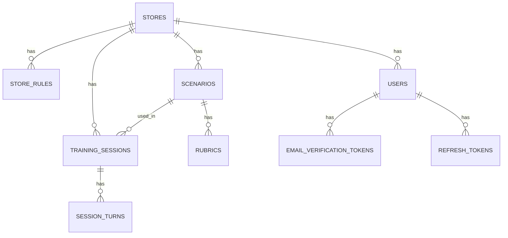

# db-schema.md — DB 스키마 (PostgreSQL)

> [plan.md](./plan.md) 5-5의 상세 스키마. 매장 맞춤 알바 훈련 서비스 MVP 기준.

## 설계 원칙

- 2026-07-15부터 사장님·알바 둘 다 이메일+비밀번호 계정(`users`)으로 로그인한다. 기존 매장 링크(`stores.link_key`)는 폐기하지 않았지만 더 이상 로그인/가입 경로로 쓰이지 않는다 — 알바 계정은 셀프 가입이 아니라 로그인한 사장님이 대시보드에서 이메일+초기 비밀번호를 정해 직접 만들어준다(`users.store_id`가 그때 바로 채워짐).
- 알바는 여전히 세션에 자유 텍스트 라벨(`staff_label`)을 남길 수 있지만, 이제는 `users` 계정과도 연결된다 — 계정 로그인은 "내 세션 이어보기"를 위한 것이고 `staff_label`은 리포트 표시용 별칭이라는 역할 구분은 유지한다.
- 루브릭·평가 결과처럼 구조가 시나리오마다 다르고 통으로 읽고 쓰는 값은 **JSONB 컬럼**에 담아 유연성을 확보한다.

## ERD



## 테이블 정의

```sql
-- 매장: 로그인 없이 링크(slug)로 식별되는 루트 엔티티
CREATE TABLE stores (
  id            UUID PRIMARY KEY DEFAULT gen_random_uuid(),
  link_key      VARCHAR(32) UNIQUE NOT NULL,        -- 매장 링크의 슬러그
  industry      VARCHAR(50) NOT NULL DEFAULT 'cafe', -- MVP는 cafe 고정
  name          VARCHAR(100),
  created_at    TIMESTAMPTZ NOT NULL DEFAULT now()
);

-- 사장님이 입력한 원본 규칙 (자연어 그대로 보관 — 루브릭 재생성 시 원문이 필요)
CREATE TABLE store_rules (
  id            UUID PRIMARY KEY DEFAULT gen_random_uuid(),
  store_id      UUID NOT NULL REFERENCES stores(id) ON DELETE CASCADE,
  category      VARCHAR(50),                  -- 예: 환불, 지연, 금지표현
  raw_text      TEXT NOT NULL,
  source        VARCHAR(20) NOT NULL DEFAULT 'text', -- text | photo(v1.5)
  created_at    TIMESTAMPTZ NOT NULL DEFAULT now()
);

-- 시나리오: 업종 템플릿 기반, 손님 역할의 페르소나·초기 상태를 담음
CREATE TABLE scenarios (
  id            UUID PRIMARY KEY DEFAULT gen_random_uuid(),
  store_id      UUID NOT NULL REFERENCES stores(id) ON DELETE CASCADE,
  type          VARCHAR(30) NOT NULL,         -- delay | out_of_stock | rule_violation
  title         VARCHAR(100) NOT NULL,
  persona       JSONB NOT NULL,               -- 손님 역할 성격·말투·초기 감정
  initial_state JSONB NOT NULL DEFAULT '{}',  -- 주문 상태·손님 기분 등 시나리오 초기값
  created_at    TIMESTAMPTZ NOT NULL DEFAULT now()
);

-- 루브릭: 규칙 → 채점 가능한 기준으로 변환된 결과. approved_at이 null이면 승인 전 초안
CREATE TABLE rubrics (
  id            UUID PRIMARY KEY DEFAULT gen_random_uuid(),
  scenario_id   UUID NOT NULL REFERENCES scenarios(id) ON DELETE CASCADE,
  criteria      JSONB NOT NULL,   -- [{item, required: bool, good_example, bad_example}]
  version       INT NOT NULL DEFAULT 1,       -- 사장님이 수정할 때마다 증가
  approved_at   TIMESTAMPTZ,                  -- null = 승인 대기 초안 (plan.md 5-3 승인 루프)
  created_at    TIMESTAMPTZ NOT NULL DEFAULT now()
);

-- 훈련 세션: 알바 1명이 시나리오 1개에 도전한 단위
CREATE TABLE training_sessions (
  id            UUID PRIMARY KEY DEFAULT gen_random_uuid(),
  store_id      UUID NOT NULL REFERENCES stores(id) ON DELETE CASCADE,
  scenario_id   UUID NOT NULL REFERENCES scenarios(id),
  staff_label   VARCHAR(50),                  -- 로그인 없음 — 자유 입력 라벨(예: "지우")
  status        VARCHAR(20) NOT NULL DEFAULT 'in_progress', -- in_progress | completed
  started_at    TIMESTAMPTZ NOT NULL DEFAULT now(),
  completed_at  TIMESTAMPTZ
);

-- 턴 단위 대화·평가 로그: 손님 발화 → 알바 답변 → 평가 판단
CREATE TABLE session_turns (
  id                UUID PRIMARY KEY DEFAULT gen_random_uuid(),
  session_id        UUID NOT NULL REFERENCES training_sessions(id) ON DELETE CASCADE,
  turn_number       INT NOT NULL,
  customer_message  TEXT NOT NULL,
  staff_answer      TEXT NOT NULL,
  evaluation        JSONB NOT NULL,   -- {충족여부, 빠진기준[], 피드백, 개선문장}
  passed            BOOLEAN NOT NULL,
  retry_count       INT NOT NULL DEFAULT 0,
  created_at        TIMESTAMPTZ NOT NULL DEFAULT now()
);

-- 계정: 사장님/알바 공용. role로 구분. 사장님은 회원가입 시엔 store_id가 비어있다가 매장 생성 성공 시
-- 채워지고, 알바는 사장님이 대시보드에서 계정을 만들어줄 때 바로 채워진다.
-- email_verified_at은 사장님 회원가입 시 이메일 인증 완료 시각(null이면 미인증). 알바는 사장님이
-- 계정을 만들어주므로 이메일 인증 대상이 아니라 항상 null.
CREATE TABLE users (
  id                UUID PRIMARY KEY DEFAULT gen_random_uuid(),
  email             VARCHAR(255) UNIQUE NOT NULL,
  password_hash     TEXT NOT NULL,
  role              VARCHAR(20) NOT NULL,          -- owner | staff
  name              VARCHAR(50),
  store_id          UUID REFERENCES stores(id) ON DELETE SET NULL,
  email_verified_at TIMESTAMPTZ,
  created_at        TIMESTAMPTZ NOT NULL DEFAULT now()
);

-- 이메일 인증용 1회용 토큰. 원문 대신 해시만 저장(비밀번호처럼 유출 대비). token_hash는 UNIQUE라
-- "이 토큰 해시가 있는지" 조회가 인덱스로 바로 된다.
CREATE TABLE email_verification_tokens (
  id          UUID PRIMARY KEY DEFAULT gen_random_uuid(),
  user_id     UUID NOT NULL REFERENCES users(id) ON DELETE CASCADE,
  token_hash  TEXT UNIQUE NOT NULL,
  expires_at  TIMESTAMPTZ NOT NULL,
  created_at  TIMESTAMPTZ NOT NULL DEFAULT now()
);

-- 로그인 유지용 재발급 토큰. 서버가 강제로 무효화(revoked_at)할 수 있고, 이미 무효화된 토큰이
-- 재사용되면 도난으로 간주해 해당 유저의 모든 토큰을 한 번에 막는 데 쓴다(로테이션).
CREATE TABLE refresh_tokens (
  id          UUID PRIMARY KEY DEFAULT gen_random_uuid(),
  user_id     UUID NOT NULL REFERENCES users(id) ON DELETE CASCADE,
  token_hash  TEXT UNIQUE NOT NULL,
  expires_at  TIMESTAMPTZ NOT NULL,
  revoked_at  TIMESTAMPTZ,
  created_at  TIMESTAMPTZ NOT NULL DEFAULT now()
);

CREATE UNIQUE INDEX idx_stores_link_key ON stores(link_key);
CREATE UNIQUE INDEX idx_users_email ON users(email);
CREATE INDEX idx_training_sessions_store_id ON training_sessions(store_id);
CREATE INDEX idx_session_turns_session_id ON session_turns(session_id);
CREATE INDEX idx_refresh_tokens_user_id ON refresh_tokens(user_id);
```

## 설계 메모

- **JSONB를 쓰는 이유**: 루브릭 `criteria`와 턴의 `evaluation`은 항목 수·구조가 시나리오마다 다르고, 지금은 전체를 통으로 읽고 쓰는 것이 대부분이라 컬럼으로 쪼갤 이득이 없다. "②번을 가장 많이 틀린 매장 찾기"처럼 JSONB 내부를 조건 검색해야 하는 요구가 생기면 그때 GIN 인덱스를 추가하거나 컬럼으로 승격한다 — v1에서 미리 하지 않는다.
- **`rubrics.approved_at`이 nullable인 것 자체가** plan.md 5-3의 "AI는 생성, 사장님은 승인" 루프를 스키마 레벨에서 표현한다: 승인 전(=`approved_at IS NULL`) 세션 생성을 막는 체크는 애플리케이션 레벨에서 건다.
- **ORM**: Prisma 권장(마이그레이션·타입 안전성을 4주 안에 거의 공짜로 얻음). raw SQL/Knex로 대체해도 스키마 자체는 동일하게 쓸 수 있다.
