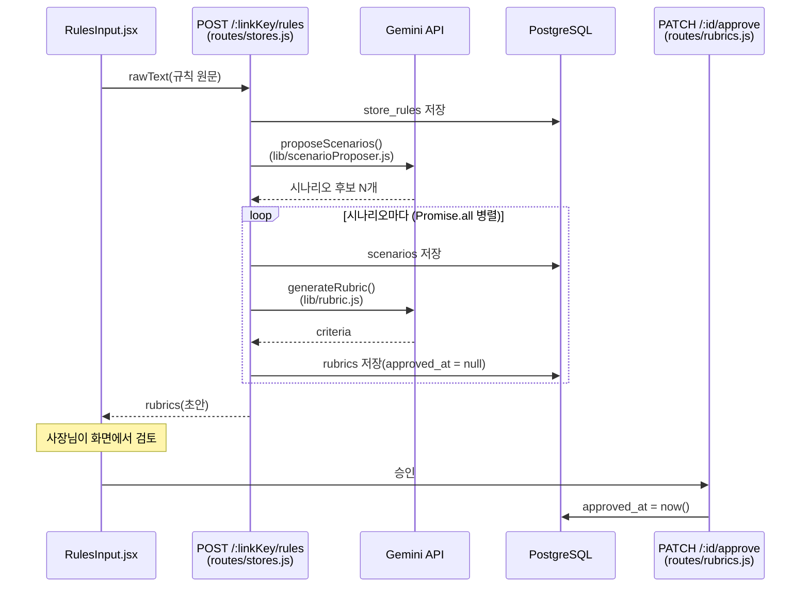
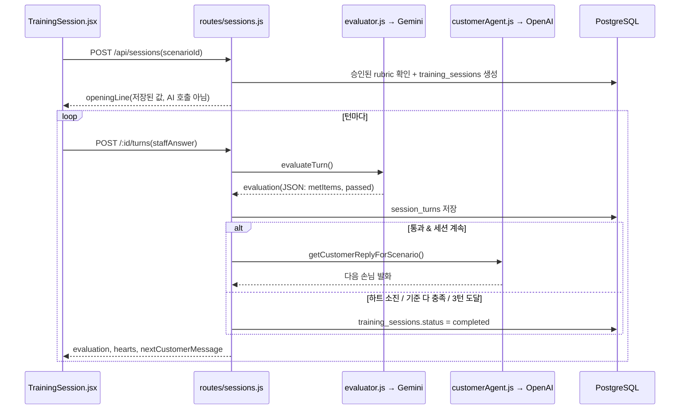

# 두 에이전트 요청 흐름

## 이게 뭔지

이 서비스의 코어는 목적이 다른 두 개의 LLM이 상태를 주고받는 루프다. README 아키텍처 절에 넣은 다이어그램을 그대로 가져와서, 왜 이 모양인지까지 정리한다.

- **손님 에이전트** (`server/src/lib/customerAgent.js`, OpenAI `gpt-4o-mini`) — 훈련 중 손님 역할 대사를 즉석에서 만든다.
- **평가 에이전트** (`server/src/lib/evaluator.js`, Gemini) — 알바 답변을 루브릭 기준으로 채점한다.
- **루브릭 생성** (`server/src/lib/rubric.js`, Gemini) — 사장님이 입력한 규칙 원문을 채점표로 변환한다.
- **시나리오 제안** (`server/src/lib/scenarioProposer.js`, Gemini) — 규칙 원문을 보고 훈련용 상황을 제안한다.

## 왜 손님은 OpenAI, 평가/생성은 Gemini인지

기준은 "틀려도 되는 일이냐"다.

- 손님 대사는 애드리브라서 매번 표현이 달라도 자연스럽기만 하면 된다 — 할루시네이션 위험이 낮고(오히려 애드리브가 자산), 호출이 잦으니 저비용 모델(OpenAI `gpt-4o-mini`)을 쓴다.
- 채점·루브릭 생성·시나리오 제안은 결과가 그대로 DB에 저장되고 훈련 흐름을 좌우한다 — 틀리면 안 되는 일이라, `responseSchema`로 JSON 출력을 강제할 수 있는 Gemini를 쓰고, 뒤에서 설명할 "루브릭"으로 한 번 더 방어한다.

**절대 두 역할을 한 호출로 합치지 않는다** — 시스템 프롬프트도, 요구 품질도, 모델도 다르기 때문. 코드에서도 파일이 완전히 분리돼 있다(`customerAgent.js` vs `evaluator.js`/`rubric.js`/`scenarioProposer.js`).

## 루브릭 = 할루시네이션 방어막

사장님이 입력한 자연어 규칙("음료는 꼭 흔들어서 드릴 것")을 AI가 그때그때 즉석 판단하게 하면, 채점 기준이 매번 미묘하게 달라질 위험이 있다. 그래서 규칙을 먼저 "①②③ 항목이 있는지" 형태의 **닫힌 채점표(루브릭)** 로 변환해두고, 실제 채점은 그 루브릭 항목만 보고 한다 — 자연어 규칙 자체를 매번 다시 해석하지 않는다.

`rubrics.approvedAt`이 `null`이면 AI가 막 생성한 초안이라는 뜻이고, 사장님이 승인하기 전까지는 훈련 세션(`POST /api/sessions`)이 그 루브릭을 쓸 수 없다(`routes/sessions.js`의 `approvedAt: { not: null }` 조건). "AI는 생성, 사장님은 승인" 원칙이 코드로는 이 한 줄 조건으로 강제된다.

## 실제 코드로 보기 — 흐름 A (규칙 → 시나리오/루브릭 → 승인)

시나리오 N개에 대한 `generateRubric` 호출이 `Promise.all`로 병렬인 이유: 시나리오들이 서로 결과를 참조하지 않는 독립적인 작업이고, 호출 하나가 20초 가까이 걸려서 순차로 돌리면 사장님이 온보딩 화면에서 너무 오래 기다린다(`routes/stores.js` 주석 참고). 병렬이라 **응답 시간**은 줄지만, Gemini 호출 자체는 시나리오 개수만큼 그대로 나가니 **API 비용**은 안 줄어든다는 점은 따로 알아둘 것.

## 실제 코드로 보기 — 흐름 B (알바 훈련 세션, 최대 3턴)

## 헷갈리기 쉬운 부분

- **`openingLine`은 AI 호출이 아니다.** `getOpeningLineForScenario(scenario)`는 그냥 `scenario.persona.opening`(시나리오 제안 때 Gemini가 이미 만들어서 DB에 저장해둔 문자열)을 꺼내는 것뿐이다(`customerAgent.js`). 세션을 시작할 때마다 오프닝 대사를 새로 생성하지 않는다 — 첫 대사는 고정, 그다음 턴부터만 `getCustomerReplyForScenario`로 실시간 생성된다.
- **루브릭 승인이 풀리는 경우** — `PATCH /:id`(수정)를 하면 내용이 바뀌었으니 `approvedAt`이 다시 `null`로 리셋된다(`routes/rubrics.js`). 승인해놓고 내용만 몰래 바뀐 루브릭이 세션에 쓰이는 걸 막기 위한 설계.
- **하트(재입력 예산)는 최종 답변이 아니라 모든 시도를 본다** — `computeHearts`는 "충족한 기준 개수"는 최종 답변 기준으로 세지만, "몇 번 깎였는지"는 재입력 시도 전부를 훑는다. 자세한 건 [Vitest 노트](../be/vitest.md)의 `computeHearts` 테스트 참고.

## 관련 개념

- [Vitest](../be/vitest.md) — `sessionTurns.js`의 `pickFinalAttempts`/`computeHearts`를 실제로 테스트한 노트
- LangChain/LangGraph 도입 검토 — 지금 이 4개 호출 지점은 전부 "프롬프트 하나 → 응답 하나"라 프레임워크가 풀어줄 문제가 없다고 판단, `docs/ai-usage-and-cost-review.md`에 근거와 재검토 조건 정리돼 있음
